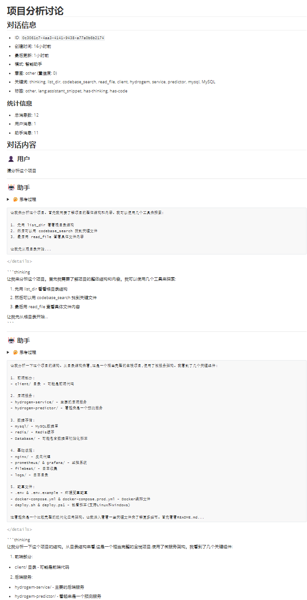

# Cursor Composer Export 对话记录导出

<div align="center">


[](https://opensource.org/licenses/MIT)

[English](README_en.md) | [简体中文](README.md)

将 Cursor Composer 对话记录导出为 Markdown 文档，完整保留思考块和助手代码片段。

</div>

## ✨ 功能特点

- 📝 导出对话记录为 Markdown 格式
- 💭 保留思考块和助手代码片段
- 🔄 保持对话上下文和格式
- 📂 自定义导出路径



## 🚀 安装说明

### 环境要求

- Node.js 14.x 或更高版本
- Cursor IDE
- 管理员权限（用于安装）

### 安装步骤

1. 克隆仓库
2. 安装依赖：
   ```bash
   npm install
   ```
3. 安装扩展：
   ```bash
   npm run install-extension
   ```
4. 重启 Cursor IDE

### 安装路径

扩展将被安装到：

**Windows**

```powershell
%LOCALAPPDATA%\Programs\cursor\resources\app\extensions\cursor-tools.cursor-export-extension-0.0.1\
```

**macOS**

```bash
/Applications/Cursor.app/Contents/Resources/app/extensions/cursor-tools.cursor-export-extension-0.0.1/
```

**Linux**

```bash
/usr/share/cursor/resources/app/extensions/cursor-tools.cursor-export-extension-0.0.1/
```

## 💫 使用方法

1. 打开 Cursor IDE
2. 点击状态栏（右下角）的"导出所有对话"按钮
3. 选择保存位置
4. 点击导出

## 🛠️ 开发调试

### 构建

```bash
# 安装依赖
npm install

# 安装扩展
npm run install-extension

# 编译 TypeScript
npm run compile

# 开发监视模式
npm run watch
```

### 调试

1. 打开 Cursor IDE 开发者工具（Ctrl+Shift+I）
2. 切换到 Console 标签页
3. 查看扩展运行日志和错误信息

### 手动安装

```bash
# Windows (PowerShell 管理员)
.\scripts\install.ps1

# Unix
npm run install-extension
```

### 卸载

```bash
# Windows (PowerShell 管理员)
.\scripts\uninstall.ps1

# Unix
# 手动删除上述安装路径中的扩展目录
```

## 🔍 故障排除

### 常见问题

1. 安装失败

   - 以管理员身份运行
   - 安装前关闭 Cursor IDE
   - 检查文件权限
2. 导出失败

   - 确保保存位置有写入权限
   - 尝试不同的保存路径
   - 查看调试控制台错误信息

## 📄 许可证

MIT 许可证 - 详见 [LICENSE](LICENSE) 文件

## 🌟 更新日志

### 0.0.1

- ✨ 首次发布
- 📝 基础 Markdown 导出
- 💭 支持思考块
- 🔄 保留助手代码片段

## 👥 联系方式

- 邮箱：zihoi.luk@foxmail.com
- GitHub Issues：[报告问题](https://github.com/TsekaLuk/Cursor-export-extension/issues)

---

<div align="center">

**Cursor Export Extension** © 2024 Tseka Luk. 基于 MIT 许可证发布。

</div>