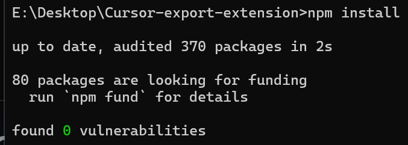
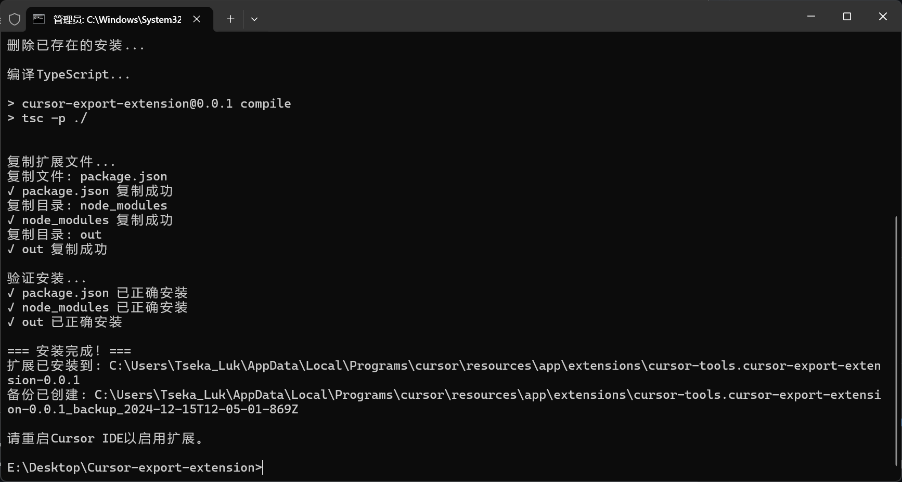
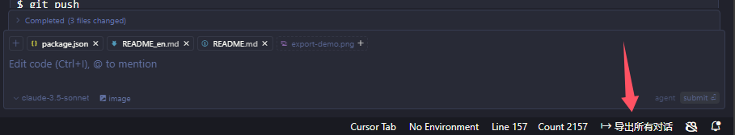
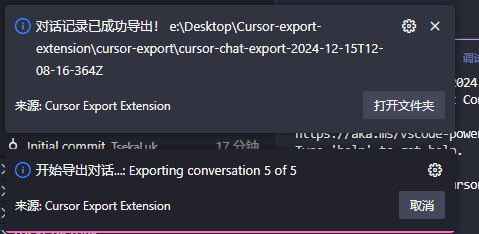

# Cursor Composer Export

<div align="center">


[](https://opensource.org/licenses/MIT)

[English](README_en.md) | [简体中文](README.md)

Export your Cursor Composer conversations to Markdown documents, preserving thinking blocks and assistant code snippets.

</div>

## ✨ Features

- 📝 Export conversations to Markdown format
- 💭 Preserve thinking blocks and assistant code snippets
- 🔄 Maintain conversation context and formatting
- 📂 Custom export path


## 🚀 Installation

### Requirements

- Node.js 14.x or higher
- Cursor IDE
- Administrator privileges (for installation)

### Install Steps

1. Clone the repository
2. Install dependencies:
   ```bash
   npm install
   ```



3. Install extension:
   ```bash
   npm run install-extension
   ```
4. Restart Cursor IDE



### Installation Path

The extension will be installed to:

**Windows**

```powershell
%LOCALAPPDATA%\Programs\cursor\resources\app\extensions\cursor-tools.cursor-export-extension-0.0.1\
```

**macOS**

```bash
/Applications/Cursor.app/Contents/Resources/app/extensions/cursor-tools.cursor-export-extension-0.0.1/
```

**Linux**

```bash
/usr/share/cursor/resources/app/extensions/cursor-tools.cursor-export-extension-0.0.1/
```

## 💫 Usage

1. Open Cursor IDE
2. Click "Export All Conversations" in the status bar (bottom right)
3. Select save location
4. Click Export



You can view detailed logs in the console during export:



## 🛠️ Development

### Build

```bash
# Install dependencies
npm install

# Install extension
npm run install-extension

# Compile TypeScript
npm run compile

# Development watch mode
npm run watch
```

### Debug

1. Open Cursor IDE Developer Tools (Ctrl+Shift+I)
2. Switch to Console tab
3. Check extension logs and error messages

### Manual Installation

```bash
# Windows (PowerShell Admin)
.\scripts\install.ps1

# Unix
npm run install-extension
```

### Uninstall

```bash
# Windows (PowerShell Admin)
.\scripts\uninstall.ps1

# Unix
# Manually delete extension directory from installation path above
```

## 🔍 Troubleshooting

### Common Issues

1. Installation Failed

   - Run as administrator
   - Close Cursor IDE before installation
   - Check file permissions
2. Export Failed

   - Ensure write permissions for save location
   - Try different save paths
   - Check debug console for error messages

## 📄 Future Plans

As an interest-driven open source project, we aim to explore the following possibilities:

### 🐛 Upcoming Fixes

- Optimize parsing of nested thinking blocks and snippet blocks
- Improve internationalization support (CN/EN) for better multilingual experience

### 🔬 Technical Exploration

- Investigate Cursor's operational mechanisms to implement:
  - Parse Cursor Tools operations and parameter extraction
  - Supported tool types:
    - `read_file`: Read file contents
    - `edit_file`: Edit file contents
    - `list_dir`: List directory contents
    - `codebase_search`: Search codebase
    - `grep_search`: Text search
    - `file_search`: Find files
    - `run_terminal_command`: Execute commands
    - `delete_file`: Delete files
  - Identify current AI model in use
  - Optimize workspace and conversation export logic
  - Enhance keyword semantic extraction and analysis

### 🚀 Vision

We aim to explore building the extension into an intelligent assistant:

1. **Context Continuity Enhancement**
   - Mitigate context fragmentation from text length limitations
   - Provide knowledge distillation for new conversation environments
   - Maintain work continuity

2. **Meta-Prompt Optimization Service**
   - Analyze user input patterns based on workspace content
   - Extract and preserve high-quality historical Meta-Prompts
   - Assist in building personalized Cursorrules documentation

> Note: As this is a passion project maintained alongside academic commitments, we look forward to the Cursor team and global AI programming community meeting users' growing personalized AI programming needs in more efficient ways.

## 📄 License

MIT License - see the [LICENSE](LICENSE) file for details

## 🌟 Changelog

### 0.0.1

- ✨ Initial release
- 📝 Basic Markdown export
- 💭 Support for thinking blocks
- 🔄 Preserve assistant code snippets

## 👥 Contact

- Email: zihoi.luk@foxmail.com
- GitHub Issues: [Report Issues](https://github.com/TsekaLuk/Cursor-export-extension/issues)

---

<div align="center">

**Cursor Export Extension** © 2024 Tseka Luk. Released under the MIT License.

</div>
